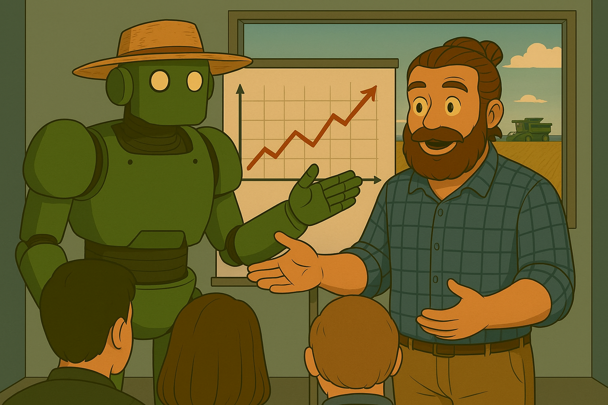

    

<small>Imagen generada por la inteligencia artificial Microsoft Copilot</small>

## SOBRE ESTA CARPETA Y SU CONTENIDO

Esta carpeta, como ya dice el nombre, es para exponer el proyecto final y el material relacionado.  
Será menos explicativa que las otras carpetas.  

## CONTENIDO

> ## "Anteproyecto_FAO.pdf"  
>> Esto no se pide, quiero decir, no es parte de los requisitos para la finalización del curso, pero lo consideré como una forma de aproximación al proyecto. Además, una buena manera de exponer la idea del proyecto al profesor.  

> ## "Dataset_Europa_crudo.xls"  
>> Es el dataset tal cual, sin ninguna limpieza, tal como se descarga. En caso de querer un dataset similar pero con otros cultivos, zonas geográficas, años, etc., puedes buscar el enlace en el archivo "Anteproyecto_FAO.pdf" y desde ahí podrás descargarlo. Si no te aclaras, puedes contactarme y te ayudaré en cuanto pueda.
>>
>## "Limpieza_y_analisis_dataset_provisional.pdf"
>>Parte de los requisitos para aprobar el curso es un informe escrito. Entre otras cosas, este informe debe contener un documento técnico con la explicación del proceso de limpieza y modelado de datos, pues en este documento se trabaja este requisito.
  

# 🚧 SIGUE EN CONSTRUCCIÓN, VUELVA PRONTO.

